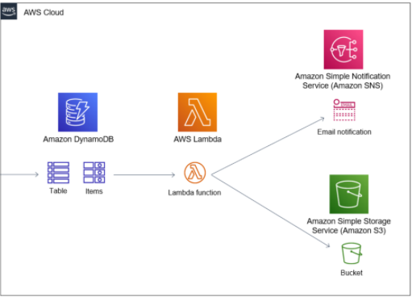
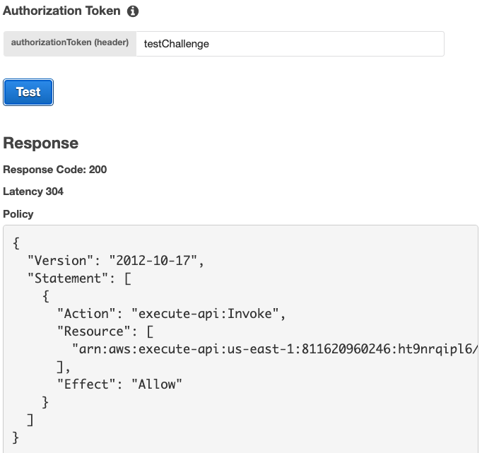
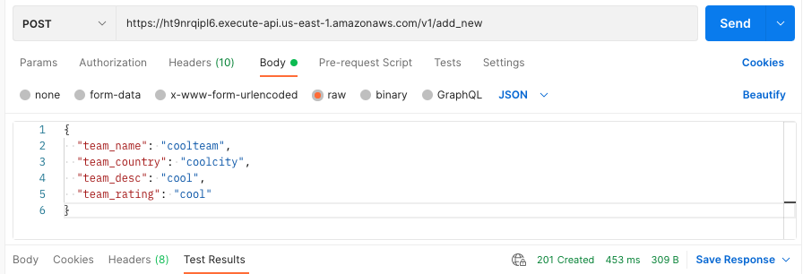

# ContinoTest

Below tasks are completed in `CICD-demo` branch, switch to `main` branch for Serverless Framework and Github Action CICD workflow 

## Tasks
Based on this scenario, please work on below tasks:

### Main Task [Done]

Make the necessary changes so data is successfully written to the DynamoDB table once a POST request is received by the API Gateway
1. Updated lambda Dynamodb permissions
2. updated Dynamodb table name in ```Reources``` to match with name in lambda function
3. Added `Lambdaloggroup` resources for debugging
4. To deploy the template
   1. Set up local AWS access key and secret
   2. run `make deploy-template`

### Secondary Task [Done]

Pick one of following:

#### Add any required resources to send a message to a SNS Topic whenever a new item is added to the DynamoDB Table.
The message can be either table updated or the content of the new item added.

4. Manually added SNS to email features for adding new `team` info to Dynamodb through APIGateway
   1. Added `src/notification.py` lambda function to handle new `item` create event
   2. Added DynamoDB Stream Trigger
   3. 
   4. 
   5. Testing email
   6. 
   7. Reference: https://www.kodyaz.com/aws/dynamodb-streams-send-sns-notification-from-aws-lambda-function-using-python.aspx
#### Implement any type of authentication to the API Gateway. [Done]
5. Created `testApiAuth` Lambda Authorizer
6. Created `testApiAuth` lambda function to process the authorization
```
   import json
    def lambda_handler(event, context):
    print(event)
    auth = 'Deny'
    if event['authorizationToken'] == 'testChallenge':
        auth = 'Allow'
    else:
        auth = 'Deny'

    authResponse = {"principalId": "testChallenge", 
                        "policyDocument": 
                        {   "Version":"2012-10-17",
                            "Statement": [ 
                                    {   "Action": "execute-api:Invoke",
                                        "Resource":[
                                            "arn:aws:execute-api:us-east-1:811620960246:ht9nrqipl6/*/*"],
                                    "Effect": auth
                                } 
                            ] 
                        } 
                    }
    return authResponse

```
7. This can be added to cloudformation to reflect on IAC
```
 # ApiAuthorizer:
  #   Type: AWS::ApiGateway::Authorizer
  #   Properties:
  #     AuthType: TOKEN
  #     AuthorizerUri: "String"
  #     Name: testApiAuth # Required
  #     RestApiId: !Ref ApiRestApi # Required
  #     Type: "String" # Required

  # ApiAuthorizerPermission:
  #   Type: AWS::Lambda::Permission
  #   Properties:
  #     Action: lambda:InvokeFunction
  #     FunctionName: testApiAuth
  #     Principal: "apigateway.amazonaws.com"
  #     SourceArn: !Sub "arn:aws:execute-api:${AWS::Region}:${AWS::AccountId}:${ApiGatewayRestApi}/authorizers/${GWAuth}"
```
8. 

## Testing result



## Test Analysis & Approaches

1. Check Cloudformation lint, use tools like cfn-lint for typos and formatting errors
2. Check API Gateway settings to see if `POST` data are passed in correctly
3. Check AWS resources and dependencies
3. Check Lambda function for handling of incoming data

### Security
1. Fellow least privileges Cloud security best practice
2. set different roles for different job functions, ie, Developer roles normally only have Readonly access to Prod and Staging environment, and DevOps can manage/delete/create resources base on needs
3. IAM roles per function for granular control
4. API gateway authentication can use both lambda and token authorisor

### Monitoring
1. Enable logging and export error metrics
2. use Dashboard tools, i.e splunk, AMG
3. forward alerts/notification to email or Slack

## References
https://docs.aws.amazon.com/apigateway/latest/developerguide/apigateway-control-access-to-api.html
